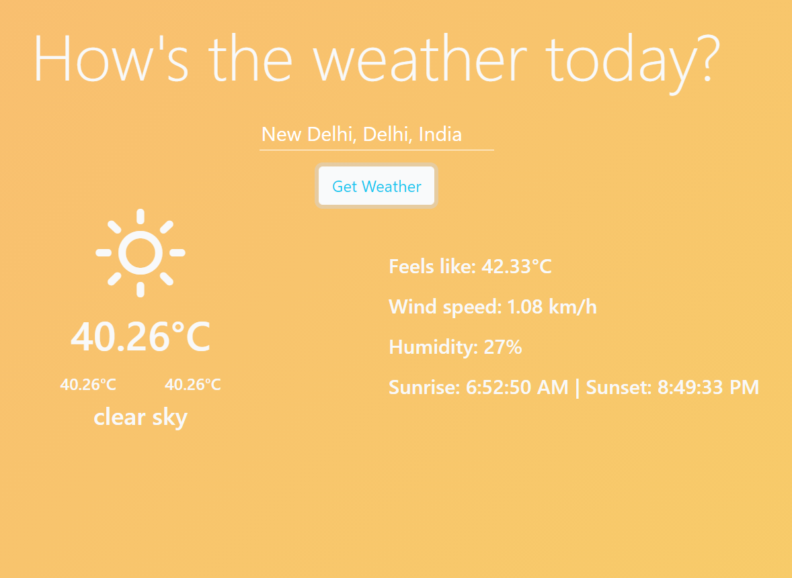

# Weather App

A weather app using React. The background color will change and animate based on the current weather condition. [React places autocomplete](https://www.npmjs.com/package/react-places-autocomplete) is used to to help the search for the city. [Open Weather Map API](https://openweathermap.org/) is used in this project.

## Installation & Usage

In the project directory, you can run:

 `npm start`

Runs the app in the development mode.\
Open [http://localhost:3000](http://localhost:3000) to view it in the browser.

The page will reload if you make edits.\
You will also see any lint errors in the console.

### Note: 
You need your own openweathermap API key and store it in a .env file in the root directory.

You also need your own Google API key and put it in index.html. In the cloud dashboard, please enable Map Javascript API and Places API.

## Problems
The autocomplete might run into error (view in browser console) due to CORS policy. One possible fix now is to install Moesif CORS extension for Chrome

## Contributing
Pull requests are welcome. For major changes, please open an issue first to discuss what you would like to change.

Please make sure to update tests as appropriate.

